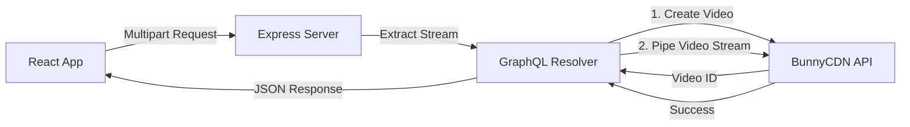

# Video Upload Process: Step-by-Step

This document explains the flow of data when a user uploads a video using this application.

## 1. The Frontend Trigger (React)
**File:** `client/src/App.tsx`

1.  **User Action:** The user selects a video file and clicks "Upload".
2.  **Apollo Client:** The `useMutation` hook is triggered.
3.  **Magic Link:** Because `UploadHttpLink` is configured in `main.tsx`, Apollo Client detects the **File** object. Instead of a standard JSON request, it automatically converts the request into a **Multipart Form Request** (the standard way to send files over HTTP).

## 2. The Server Interception (Express)
**File:** `index.js`

1.  **Middleware:** The request hits the server at `http://localhost:3000/graphql`.
2.  **Processing:** The `graphqlUploadExpress` middleware (from `graphql-upload-minimal`) sits before the Apollo Server. It intercepts the multipart request, extracts the file stream, and passes it into the GraphQL context.

## 3. The Resolver Logic (GraphQL)
**File:** `resolvers.js`

This is where the core logic resides inside the `uploadVideoToBunny` mutation:

1.  **Receive Stream:** The resolver receives the file as a Promise. It calls `await file` to get the `createReadStream` function.
2.  **Step A - Create Entry:** It sends a `POST` request to the BunnyCDN API (`https://video.bunnycdn.com/...`) with the video title.
    *   **Bunny Responds:** Returns a new Video ID (`guid`) for the entry.
3.  **Step B - Stream Data:** Instead of saving the large video file to the local server's disk, the resolver takes the **Read Stream** from the user's upload and pipes it directly into a **Write Stream** to BunnyCDN (`PUT` request).
    *   **Efficiency:** The server acts as a pipe. Data flows in from the user and immediately flows out to BunnyCDN, using minimal RAM and no local disk storage.

## 4. The Response
1.  **Bunny Confirms:** Once the stream finishes, BunnyCDN confirms the upload is complete.
2.  **Resolver Returns:** The backend constructs a response object (containing ID, Title, Status) and sends it back to the client.
3.  **UI Update:** The React app receives the data and displays the result to the user.

## Visual Flow

